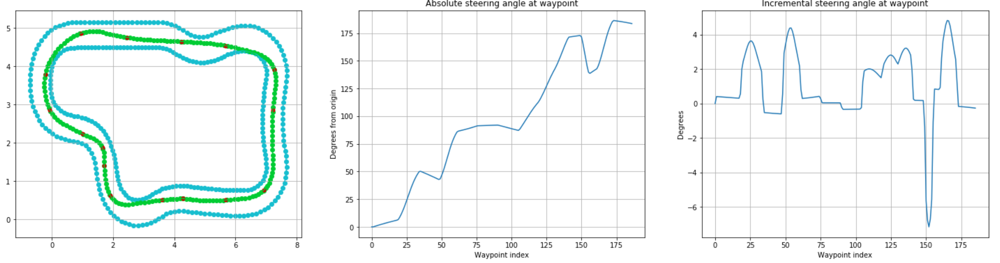

# DeepRacer Racetrack Route Generator
> A genetic algorithm-based approach for generating optimized racetrack traversal routes

The Route Generator takes DeepRacer racetrack data as input and employs a stochastic process to approximate an optimal traversal route, given a few assumptions about the characteristics of the DeepRacer vehicle. The output is an ordered waypoint list registered to the same coordinate system as the input. The route coordinates may be exported to a file or another format to embed in the DeepRacer reward function. The program itself requires non-trivial computation time, and is not suitable for runtime execution from the reward function.

## Installation

This program can be cloned and directly executed from a default anaconda python3 jupyterlab/notebook install.

## Usage

1. Load the program dependencies in your jupyter session
```python
%run ./src/Racetrack.ipynb
%run ./src/RacetrackCommandNodeSeries.ipynb
%run ./src/SimpleGeneticAlgorithm.ipynb
%run ./DeepRacerRouteGAMethods.ipynb
```

2. Override global control variables (declared in DeepRacerRouteGAMethods.ipynb)
```python
#How many routes in the pool
pool_size = 10
#How many generations to run
num_generations = 10
#How frequently (number of generations) between status reports 1 => report every generation
reporting_frequency = 1
#Set the frequency of command points at initialization. 
#Use a lower number for tracks that have tight turns or broadly spaced waypoints
#A higher number is better for circularized tracks with few sharp turns and will also converge faster
init_cp_frequency = 20
#Verbosity 0:silent, 1:basic, 2:unbearable
verbosity = 1
```

3. Initialize the racetrack and simpleGeneticAlgorithm objects
```python
racetrack = Racetrack(waypointFilePath="./track-data/London_Loop_Train.npy")
simpleGeneticAlgorthm = SimpleGeneticAlgorthm(pool_size=pool_size)
```

4. Assign the genetic algorithm methods to the GA object (declared in DeepRacerRouteGAMethods.ipynb)
```python
simpleGeneticAlgorthm.setInitializationMethod(initializationMethod)
simpleGeneticAlgorthm.setCrossoverMethod(crossoverMethod)
simpleGeneticAlgorthm.setMutationMethod(mutationMethod)
simpleGeneticAlgorthm.setFitnessMethod(fitness_method=fitnessMethod)
simpleGeneticAlgorthm.setReportingMethodAndFrequency(reporting_method=reportingMethod, reporting_frequency=reporting_frequency)
```

5. Kick off the evolution process
```python
best_commandNodeSeries = simpleGeneticAlgorthm.evolve(num_generations=num_generations)
```

6. Visualize the final route
```python
best_commandNodeSeries.plotBigTrackAndRoute(coordinate_labels=True)
```

7. Export the route waypoint series
```python
np.save('./results/London_Loop_Train-route.npy', np.asarray(best_commandNodeSeries.route_waypoints))
```

## Motivation & background

The DeepRacer PPO is perfectly capable of finding an optimal route, given a suitable reward function. However, the racetrack solution space is sufficiently large to make this an expensive endeavor in terms of compute, time, and AWS fees. By providing the DeepRacer with "hints" about how to navigate the racetrack efficiently in the reward function by using a precomputed route, the cost necessary to converge at a suitable policy may be reduced. 

## How it works

Prospective vehicle routes are represented as an interpolation over a series of stochastically generated command points. A command point consists of two values: an index, corresponding to the index of an inner track boundary waypoint, and a quantity between \[0, track_width\]. The quantity indicates the distance of the command point from the inner track waypoint, perpendicular to the track edge, as measured between the waypoint and its indexed predecessor. The distance quantity is initialized as a bounded gaussian in order to bias command point values closer to the center of the track.

A cubic beizer curve is employed to interpolate the sequence of command points. Waypoints are generated at regular intervals along the interpolation.

The proposed route may run out-of-bounds. Therefore, a recursive checking routine is executed to resolve out-of-bounds route scenarios. The out-of-bounds check is conducted via a spatial index search (KD tree) that determines the distance between each route waypoint and its closest inner and outer boundary waypoint. If the distance from the route waypoint to either the closest inner or outer track boundary waypoint is greater than the width of the track, then the route waypoint is deemed to lie out-of-bounds. A new command point is generated at the nearest inner track boundary waypoint of the first sequential route waypoint that is deemed out-of-bounds. The interpolation and route waypoints are then recalculated incorporating the new command point, and re-assessed for violation of the track boundaries.

The boundary checking routine is relatively computationally expensive, making a brute-force exploration of the solution space prohibitive to developers of small means. A genetic algorithm is implemented to help offset the cost of route exploration. 

The GA fitness function is calculated based on the distance and relative angle between each pair of route waypoints. It is generally designed to mimic traversal by a vehicle constrained by maximum speed at rate of turn. While a higher-fidelity simulation is certainly possible, insufficient data about the acceleration and cornering speed constraints on either the DeepRacer simulated vehicle or its physical counterpart make this impractical as of time of writing.

The GA mutation function selects one of three operations to perform on the route: remove a command point, add a command point, or adjust the distance on an existing command point

The GA crossover function picks two random cut points corresponding to track inner boundary waypoints, and swaps all command points between each of the two routes.

## Limitations of this approach

Requirements of the current implementation:
- The width of the track must be uniform
- Track must take the form of a loop; the initial waypoint coordinates must align with the final waypoint coordinates
- Inner track waypoint sequences must be correctly ordered

Because the search space is large and a genetic algorithm has been employed to help approximate an optimal route, this program probably cannot be effectively used on-line. Rather, an optimal route should be precomputed and loaded for use as part of the DeepRacer activation function.

Data about the DeepRacer vehicle is not currently readily available. The current implementation of the fitness function is a very rough approximation, designed to impose plausible costs of sharp cornering and route inefficiency. The provided implementation assumes instant acceleration and does not simulate tire traction or similar physics concerns. The actual DeepRacer simulation and its physical proxy may experience very different behavior, and therefore may have a substantially different optimal route 

### Functional tracks:
- Bowtie_track
- London_Loop_Train
- New_York_Track
- Oval_Track
- Tokyo_Training_Track
- AWS_track
- Virtual_May19_Train_track

### Nonfunctional tracks:
- Reinvent_base => There seems to be a problem with the inner track data waypoint sequence reversing along the y apex
- New_York_Eval_Track => There seems to be a problem with the inner track data waypoint sequence
- H_Track => Algorithm assumes a uniform track width
- Straight_Track => Algorithm assumes circular track. This could be changed if there are nontrivial instances in the future.

## Acknowledgements
- Special thanks to Jorge Silva whose fantastic [blog post](https://medium.com/myplanet-musings/the-best-path-a-deepracer-can-learn-2a468a3f6d64) has partially inspired this approach.
- Special thanks to ARCC for their concise [blog post](https://medium.com/@autonomousracecarclub/visualizing-aws-deepracer-waypoints-9b94e6311b7a) primer on how to load DeepRacer track data.
- Racetrack data sourced from [AWS DeepRacer workshop samples](https://github.com/aws-samples/aws-deepracer-workshops/tree/master/log-analysis)
